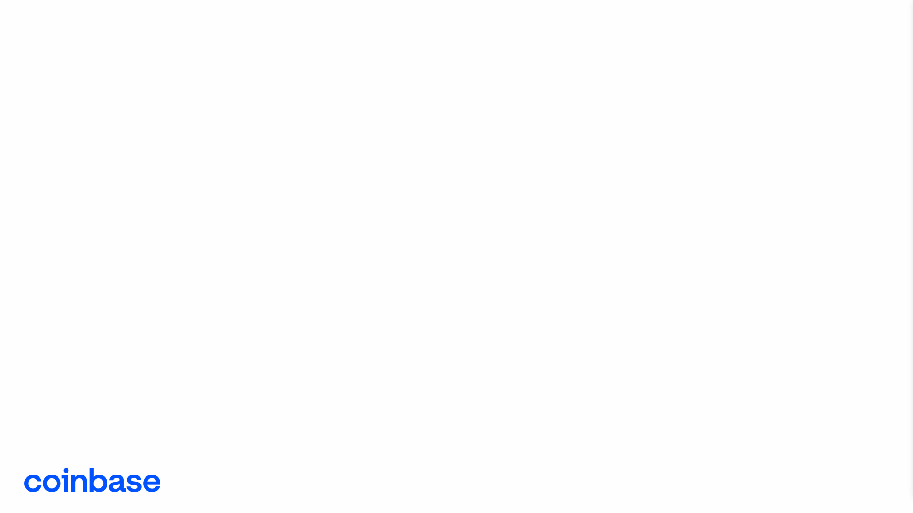
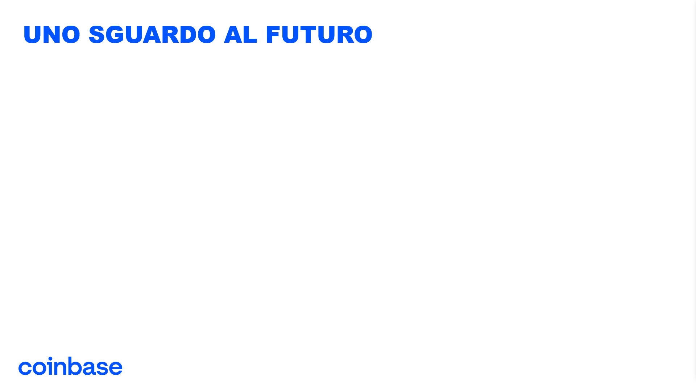

# Coinbase Strategy Analysis
### Overview
This repository contains a comprehensive analysis of Coinbase's strategy utilizing various strategic analysis frameworks such as SWOT, PESTEL, and concurrence analysis. The aim of this project is to provide insights into Coinbase's positioning within the cryptocurrency market, examining both internal and external factors influencing its strategy.

### Contents
1. <b>SWOT Analysis:</b> A detailed examination of Coinbase's strengths, weaknesses, opportunities, and threats, offering an internal perspective on its strategic landscape.

2. <b>PESTEL Analysis:</b> An exploration of the political, economic, social, technological, environmental, and legal factors impacting Coinbase's operations and strategy.

3. <b>Concurrence Analysis:</b> An assessment of Coinbase's competitive landscape, including competitors' strategies, market share, and key differentiators.

4. <b>Additional Insights:</b> Supplementary analysis providing further context and understanding of Coinbase's strategic decisions and industry dynamics.

### Usage
Feel free to explore each analysis section to gain a comprehensive understanding of Coinbase's strategic position. These insights can be valuable for investors, industry analysts, or anyone interested in understanding the dynamics of the cryptocurrency market and Coinbase's role within it.

### Disclaimer
This analysis is based on publicly available information and does not constitute financial advice or a recommendation to invest in Coinbase or any other cryptocurrency-related assets. Investors should conduct their own research and consult with financial professionals before making investment decisions.

## Presentation

